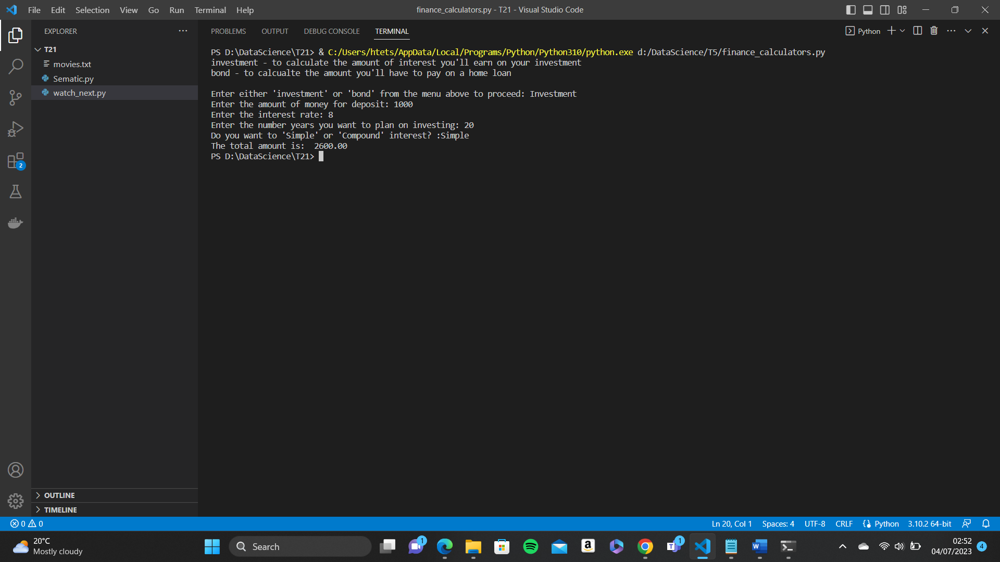
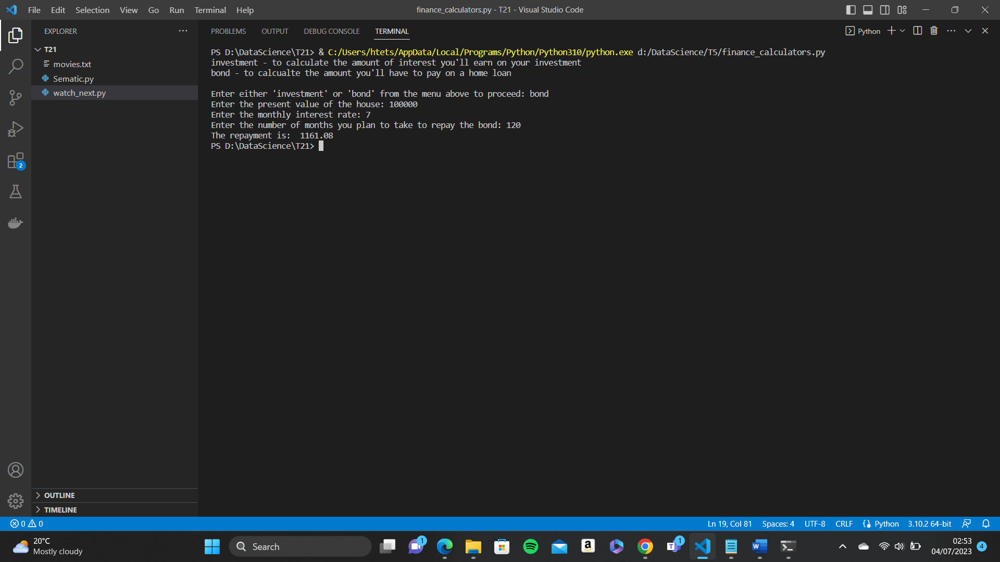

# finalCapstone
## NLP Capstone Project 

In a file called nlp_1.pdf cagtegorise which types of NLP application applies for the following use-cases: 
1. A model that allocates which mail folder an email should be sent to (work,friends, promotions, important), like Gamil's inbox tabs.
2. A model that helps decide what grade to award to an essay question. This can be used by a university professor who grades a lot of classes or essay competitions.
3. A model that provides assistive technology for doctors to procide their diagonisis.

In a file called nlp_2 decribes aobut an innovative technology using NLP which is Google assistant by Google. All the deatils of NLP usage for google assistant are explained in this document. 

## Capstone Project - Variables and Control Structures

finance_calculators.py is a prgram that allows the user to access two different fincanical calcualtors: 
* an investment calculator
* a home loan repayment calculator

### Installation

_**You can just download the finance_calculators.py file and run it with visual studio code. Python needs to be installed before.**_

**You are allowed to choose which calcualation they want to do.**

### Investment 
This is to calculate the amount of interest you'll earn on your investment

### Bond
This is to calculate the amount you'll have to pay on a home loan

_**The program works whether the user types the letter captial or not**_
_**The program gives the error message and asks for input again if you give wrong input**_

### _Investment_ 
You need to input the following:
* The amount of money that they are depositing.
* The interset rate (as a percentage). You can just enter only the number, for example, 8 not 8%.
* The number of years you plan on investing.
* Then you need to choose SIMPLE or COMPUND interest

### _Bond_
You need to input the following:
* The present value of the house
*  The interset rate
*  The number of months you plan to take to repay the bond

### _Output_
The program will calcuate how much money you will have to repay each month and give the output

### Screenshot how to run the program 

* This image shows the result of calculation with Investment type.
  
* This image shows the result of calcualtion with Bond type.
  
  

